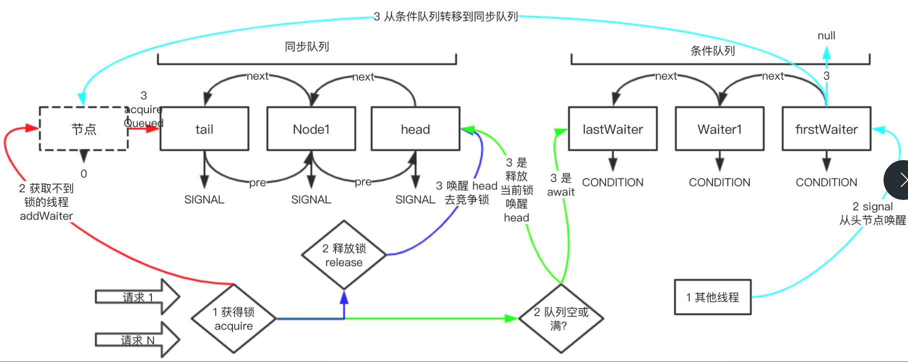

# AbstractQueuedSynchronizer源码分析

## 总体概述

AbstractQueuedSynchronizer中文翻译同步器 简称 AQS 是各个锁的的基础，比如 ReentrantLock、CountDownLatch 等等，这些我们经常用的锁底层实现都是 AQS ，所以学好 AQS 对于理解锁的实现是非常重要的。

## 整体架构



这个图总结了 AQS 整体架构的组成，和部分场景的动态流向。

1. AQS 中队列只有2个 同步队列 + 条件队列 底层数据结构两者都是链表；
2. 图中有四个颜色代表不同场景，123序号，代表着看的顺序

AQS本身是一套锁的框架，它定义了获得锁和释放锁的代码结构，所以如果新建锁 只要继承AQS，并实现相应的实现。

### 类注释

1. 提供了一种框架，自定义了先进先出的同步队列，让获取不到锁的线程能进入同步队列排队
2. 同步器有个状态值，可以根据这个状态值判断是否获取锁，此时设计及的关键在于依赖安全 atomic value 来表示状态
3. 子类可以新建非 public 的内部类，用内部类来继承 AQS 从而实现锁的功能
4. 子类可以通过给状态 CAS 赋值来决定能否拿到锁，可以定义那些状态可以获得锁， 那些状态表示取不到锁
5. AQS 提供了排他模式和共享模式，排他模式: 只有一个线程可以获得锁，共享模式:可以让多个线程获得锁，子类 ReadWriteLock 实现了两种模式
6. 内部 ConditionObject 可以被用做 Condition 我们通过 new ConditionObject() 即可得到条件队列
7. AQS 实现了锁，排队，锁队列等框架，至于如何获得锁， 释放锁的代码并没有实现，比如 tryAcquire  tryRelease、tryAcqireShared、tryReleaseShared、isHeldExclusively 这写方法
8. AQS 继承AbstractOwnableSynchronizer 是为了方便跟踪获得锁的线程，可帮助监控和诊断工具识别是那些线程持有锁
9. AQS 同步队列和条件队列， 获取不到锁的节点在入队是先进先出，但是被唤醒时，可能并不会按照先进先出的顺序执行

AQS 的类注释很多很多，以上 9 点是比较重要哦的注释总结

### 类定义

AQS 类定义

```java
public abstract class AbstractQueuedSynchronizer
    extends AbstractOwnableSynchronizer
    implements java.io.Serializable {}
```

1. AQS 是抽象类，就是给各种锁子类继承的，AQS 定义了很多如何获得锁，如何释放锁的抽象方法，目前就是为了让子类实现的

2. 继承 `AbstractOwnableSynchronizer` 就是为了监听是否获得锁，方便监控用的，

   ```java
   protected AbstractQueuedSynchronizer() { }
      /**
        * Convenience method to interrupt current thread.
        */
       static void selfInterrupt() {
           Thread.currentThread().interrupt();
       }
   ```

### 基础属性

AQS 的属性可以简单分为四类: **同步器简单属性**  **同步队列属性**  **条件队列属性** **公用Node**

