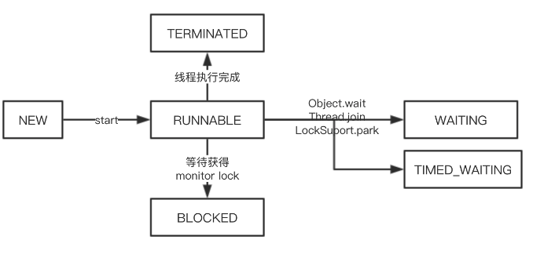

# Thread源码分析

## 类注释

### Thread 

1. 每个线程都有优先级，高级优先级的线程**可能**会优先执行；

2. 父线程创建子线程后，优先级、是否是守护线程等属性父子线程是一致的；

3. JVM启动时，通常都启动 MAIN非守护线程，以下任意情况发生时，线程就会停止；

   退出方法被调用，并且安全机制允许这么做（`Thread.interrupt`）

   所有非守护线程都消亡，或者从运行的方法正常返回，或者运行的方法抛出异常

4. 每个线程都有自己名字，多线程可能具有相同的名字，Thread的构造器如果没有指定名称会自动生成一个名字

## 线程的基本概念

### 线程状态



我们解析一下这个图：

1. New 表示线程创建成功，但是没有运行 在new Thread 之后，没有start 之前 线程的状态都是new；

2. 当我们start方法，子线程被创建成功后，子线程状态变成 RUNNANBLE，RUNNABLE表示线程已经运行中；

3. 子线程运行完成，被打断，被终止，状态都会从 RUNNANBLE 变成 TERMINATED

   TERMINATED表示运行已经结束

4. 如果线程整好在等待获得monitor lock 锁，比如 正在等待进入synchronized修饰的代码块或者方法时，会从RUNNABLE 变成 BLOCKED ，BLOCKED被阻塞
5. WAITING 和 TIMED_WAITING类似，都表示在遇到Object#wait Thread#join这些方法 都会等待另外的线程执行完成特定的动作后，才能结束等待，只不过 TIME_WAITING 是带有等待时间

### 优先级

优先级代表线程执行的机会的大小，优先级高的可能有限执行，低的可能后执行，在Java源码中，优先级从低到高，1-10 默认new 出来的优先级都是5

```java
 /**最低
  * The minimum priority that a thread can have.
  */
 public final static int MIN_PRIORITY = 1;

/**普通 默认
  * The default priority that is assigned to a thread.
  */
 public final static int NORM_PRIORITY = 5;

 /**最大
  * The maximum priority that a thread can have.
  */
 public final static int MAX_PRIORITY = 10;
```


### 守护线程

我们默认创建的线程是非守护线程，创建守护线程时，需要将 Thread 的 daemon 属性设置成true，守护线程的优先级最低，当JVM退出时，是不会关心有无守护线程的，即使还有很多守护线程，JVM 仍然退出，我们在工作中，可能会写一些监控工作，这时我们那都是用守护子线程去做，这样即使监控抛错，但因为子线程，所以不会影响到业务的主线程，因为守护线程，所以JVM也无需关注监控是否正在运行，该退出就退出，所以对业务不会影响。

### ClassLoader

ClassLoader 我们可以简单理解成类加载器，就是把类文件 二进制数组，URL等位置加载成运行Class。

## 线程两种初始化方式

无返回值的线程主要有两种方式

### 继承 Thread，成为Thread的子类

```java
public class MyThread extends Thread {

    @Override
    public void run() {
        System.out.println(Thread.currentThread().getName());
    }
}
 public static void main(String[] args) {

        new MyThread().start();
    }
```

start源码分析

```java

public synchronized void start() {
    //如果没有初始化，抛错
    if (threadStatus != 0)
        throw new IllegalThreadStateException();

 	
    group.add(this);
	//started是个标识符 我们做一些事情的时候，继续这么写
  //动作发生之前标记符是，false，发生完成之后变成true
    boolean started = false;
    try {
      //这里会创建一个新的线程，执行完成后，新的线程已经运行了，既target的内容已经在运行了
        start0();
      //执行主线程
        started = true;
    } finally {
        try {
          //如果失败，把线程从线程组中删除
            if (!started) {
                group.threadStartFailed(this);
            }
        } catch (Throwable ignore) {
            /* do nothing. If start0 threw a Throwable then
              it will be passed up the call stack */
        }
    }
}

private native void start0();
```

### 实现Runnable

```java
   // Thread 实现 Runnable
    // 如果没有传递 Runnable 对象实现，空执行
    Thread thread = new Thread(ThreadDemo::sayHelloWorld); // 方法引用
    thread.start(); // 启动线程
    thread.join();  // 等待线程结束
    System.out.println("Hello Next...");
    System.out.print(thread.getState());
}

public static void sayHelloWorld() {
    System.out.printf("线程 [Id : %s] : Hello,World!\n", Thread.currentThread().getId());
}
```

### 实现Runable接口，作为Thread的入参

```java
   // Thread 实现 Runnable
    // 如果没有传递 Runnable 对象实现，空执行
    Thread thread = new Thread(ThreadDemo::sayHelloWorld); // 方法引用
    thread.start(); // 启动线程
    thread.join();  // 等待线程结束
    System.out.println("Hello Next...");
    System.out.print(thread.getState());
}

public static void sayHelloWorld() {
    System.out.printf("线程 [Id : %s] : Hello,World!\n", Thread.currentThread().getId());
}
```

这种就是实现 Runnable的接口，作为 Thread 构造器的入参，我们调用时使用了两种方式，可以根据情况选择使用start或 run方法，使用start 会开启子线程来执行 run 里面的内容 使用 run 方法还是主线程

### 线程初始化

```java
/**
 * Initializes a Thread.
 *
 * @param g the Thread group
 * @param target the object whose run() method gets called
 * @param name the name of the new Thread
 * @param stackSize the desired stack size for the new thread, or
 *        zero to indicate that this parameter is to be ignored.
 * @param acc the AccessControlContext to inherit, or
 *            AccessController.getContext() if null
 * @param inheritThreadLocals if {@code true}, inherit initial values for
 *            inheritable thread-locals from the constructing thread
 */
//g 表示线程组 线程组可以组内的线程进行批量操作，比如批量的打断 interrupt
// target 运行的对象
// name 线程名称 不传 默认 Thread- + nextThreadNum,nextThreadNum方法
// stackSize 可以设置堆栈的大小
private void init(ThreadGroup g, Runnable target, String name,
                  long stackSize, AccessControlContext acc,
                  boolean inheritThreadLocals) {
    if (name == null) {
        throw new NullPointerException("name cannot be null");
    }

    this.name = name;
		//当前线程作为父线程
    Thread parent = currentThread();
    SecurityManager security = System.getSecurityManager();
  //如果线程组为空
    if (g == null) {
        /* Determine if it's an applet or not */

        /* If there is a security manager, ask the security manager
           what to do. */
      //默认安全管理里的线程组
        if (security != null) {
            g = security.getThreadGroup();
        }

        /* If the security doesn't have a strong opinion of the matter
           use the parent thread group. */
      //兜底默认父线程的线程组
        if (g == null) {
            g = parent.getThreadGroup();
        }
    }

    /* checkAccess regardless of whether or not threadgroup is
       explicitly passed in. */
    g.checkAccess();

    /*
     * Do we have the required permissions?
     */
    if (security != null) {
        if (isCCLOverridden(getClass())) {
            security.checkPermission(SUBCLASS_IMPLEMENTATION_PERMISSION);
        }
    }

    g.addUnstarted();

    this.group = g;
  //父线程的作为守护线程
    this.daemon = parent.isDaemon();
  //线程优先级
    this.priority = parent.getPriority();
    if (security == null || isCCLOverridden(parent.getClass()))
        this.contextClassLoader = parent.getContextClassLoader();
    else
        this.contextClassLoader = parent.contextClassLoader;
    this.inheritedAccessControlContext =
            acc != null ? acc : AccessController.getContext();
    this.target = target;
    setPriority(priority);
  	//当父线程的inheritThreadLocals的属性不为空
  //会把inheritThreadLocals的属性全部传导子线程内
    if (inheritThreadLocals && parent.inheritableThreadLocals != null)
        this.inheritableThreadLocals =
            ThreadLocal.createInheritedMap(parent.inheritableThreadLocals);
    /* Stash the specified stack size in case the VM cares */
    this.stackSize = stackSize;

    /* Set thread ID */
  // 线程ID自增
    tid = nextThreadID();
}
```

## 线程其他操作

join 的意思就是当前线程等待另外一个线程执行完成之后，才能继续操作

```java
public void  joinDemo() throws InterruptedException {
    Thread main = Thread.currentThread();
    System.out.printf("主线程{%d}", main.getName());

    Thread thread = new Thread(new Runnable() {
        @Override
        public void run() {
            System.out.printf("子线程{%d}", Thread.currentThread().getName());
        try {
            Thread.sleep(3000);
        }catch (Exception e) {

        }
        }

    });
    thread.start();
    thread.join();
}
```

执行的结果，就是主线程在执行 Thread.join() 代码后会停止，会等待子线程沉睡30秒后再执行，这里的join的作用就是让主线程等待子线程执行完成。


### yield

yield是个native方法

意思是当前线程做出让步，放弃当前CPU 让出CPU重新选择线程，避免线程过度使用CPU 我们写 while 死循环的时候，预计短时间内while死循环可以结束的话，可以在循环使用 yield 方法，防止CPU一直被while死循环霸占。